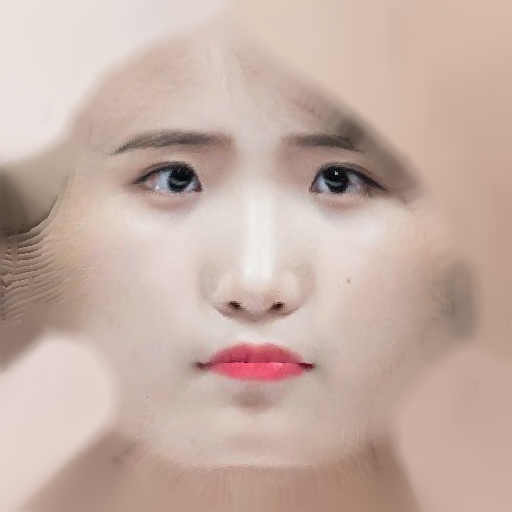

#Face Reconstruction from single shot image

```
python face.py [input path]
```


### Sigle Shot Face Reconstruction
#### (3D Morphable Face Model fitting)


한 장의 이미지에서 3D Face를 생성한다. 인풋 이미지는 프로필 사진을 사용했다. 위 이미지가 유일한 인풋이다.   

1. 이미지에서 Face Landmark Detection  
   - Dlib [링크](https://github.com/davisking/dlib) 을 사용했다.
2. 3D Morphable Model에 Fitting 
   - EOS를 [링크](https://github.com/patrikhuber/eos) 사용했다.
3. Texture와 Model 저장

[Github](https://github.com/givenone/face-recon) 에서 코드를 확인할 수 있다.

하드웨어를 사용하는 스캐너와 달리, 3D Morphable Model에 Fitting하는 것이기 때문에 정확한 Geometry는 얻을 수 없다. 인류 얼굴의 평균인 3DMM으로부터 통계적인 변환을 거치는 알고리즘을 사용한다. 따라서 동양인의 경우에는 원래보다 더 서구적인 얼굴형이 생성된다.  

Face Landmark를 기준으로 fitting되기 때문에 다른 모델과 대비해 눈,코,입 등 텍스쳐의 위치가 정확하다. 따라서 정확한 Geometry가 아니어도 상당히 자연스러운 것을 확인할 수 있다.

텍스쳐 이미지는 아래 이미지처럼 저장된다. 

### Fun Cool Sexy


### Update

mask정보를 사용하여 머리카락 부분을 피부의 dominant한 색으로 변경해주는 기능을 추가했다. 연속적이지 않아서 자연스럽진 않지만, 머리카락을 덮기 위해 얼굴을 만드는 것이기 때문에 얼굴만 보면 조금 부자연스러울 순있다. 머리카락이 얼굴 텍스쳐에 들어가면 안되기 때문에 지운 것이다.